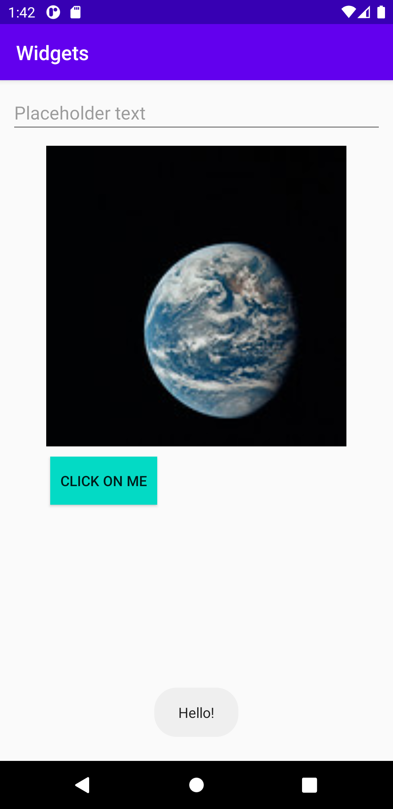

# Rapport

*Rapport - Assignment 3: Widgets 

**Layout

```
<LinearLayout xmlns:android="http://schemas.android.com/apk/res/android"
    xmlns:app="http://schemas.android.com/apk/res-auto"
    xmlns:tools="http://schemas.android.com/tools"
    android:layout_width="match_parent"
    android:layout_height="match_parent"
    tools:context=".MainActivity"
    android:orientation="vertical">
```
En LinearLayout skapades i activity_main.xml med vertikal orientation enligt kodsnutten ovan. 


```
        android:layout_marginTop="10dp"
        android:layout_marginLeft="10dp"
        android:layout_marginRight="10dp"
```
I layouten lades en TextView widget till som tilldelades attribut för id, bredd, höjd och margins.
Kod för margins kan ses i kodsnutten ovan.


```
app:srcCompat="@drawable/publicdomainearth"
        android:layout_marginTop="10dp"
        android:layout_gravity="center"/>
```
En imageview lades till där höjd och bredd sattes med dp. Bilden "publicdomainearth.jpg"
lades till i mappen drawable och lades till i imageview. Bilden centrerades i layouten med
"gravity: center". I ovanstående kod läggs bilden till med attributet app:srcCompat, samt 
attribut för marginTop och gravity. 


```
<Button
        android:id="@+id/minKnapp"
        android:text="Click on me"
        android:layout_width="wrap_content"
        android:layout_height="wrap_content"
        android:layout_marginTop="10dp"
        android:layout_marginLeft="50dp"
        android:padding="10dp"
        android:background="@color/colorAccent"/>
```
En knapp widget lades till i layouten vilken tilldelades ett id, layout attribut för dimensioner,
margins, padding, en bakgrundsfärg etc vilket kan ses i koden ovan. 


```
my_button.setOnClickListener(new View.OnClickListener() {
            @Override
            public void onClick(View view) {
                Log.d("==>","onClick worked!");
                Toast.makeText(MainActivity.this, "Hello!", Toast.LENGTH_SHORT).show();
            }
        });
```
En metod "onClick" lades till för knappen för att skriva ut ett Toast meddelande i appen.
Variabeln my_button har fått åtkomst till knappen i layouten genom knappens id.


**Screenshot i AVD för appens layout och widgets.

